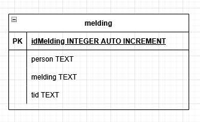

# Et "typisk" Node JS-prosjekt: Chatteapp
Dette er et eksempel på hvordan du setter opp et typisk Node JS-prosjekt, her eksemplifisert ved å lage en
SÆRS enkel chatteapplikasjon. Vi gjør mange forenklinger for å minske kodemengden og kompleksiteten, der
det anbefales å utvide dette med mer avansert funksjonalitet etter hvert.

Navigasjon:
- [Steg 1: Planlegg appen](#steg-1-planlegg-appen)
- [Steg 2: Sett opp prosjektet](#steg-2-sett-opp-prosjektet)
- [Steg 3: Sette opp server](#steg-3-sette-opp-server)
- [Steg 4: Legge til en nettside som kan vise innhold fra databasen](#steg-4-legge-til-en-nettside-som-kan-vise-innhold-fra-databasen)
- [Steg 5: Skrive data til databasen, fra nettsiden](#steg-5-skrive-data-til-databasen-fra-nettsiden)

## Steg 1: Planlegg appen
Dette kan være så mangt, men det kan være smart å se på hvilken teknologi du ønsker å bruke, i tillegg til
både designet av appen og hva den skal gjøre, samt hvordan du skal lagre data i en database.

### Teknologi:
Her er det mye du kan tenke på, men ofte blir teknologien valgt for deg i de ulike prosjektene du jobber med.

Som nå, da vi skal bruke følgende "stack":
- `Node JS`
- `Express`
- `SQLite`, og mer konkret `better-sqlite3`-biblioteket

Husk igjen at vi i dette prosjektet gjør ting så enkelt som mulig (i første omgang).

### Design:
Todelt GUI, et område for å vise meldinger, og et annet for å skrive inn nye meldinger.

### Datamodell og database:
Vi forenkler veldig, og lager en datamodell som viser hva vi ønsker å ha med. Vi må som sagt også bestemme hvilken database vi ønsker å bruke. En av de enkleste å komme i gang med er SQLite.

#### Datamodell:



At tid er TEXT kan oppleves rart, men det kommer an på hvordan SQLite fungerer. Her er noen tips om hvordan dette kan bli løst:
- Standard tidskodeformat: `YYYY-MM-DD HH:MM:SS`
- I Javascript/SQL kan vi nå for eksempel bruke: 
```sql
const stmt = db.prepare('INSERT INTO melding (tekst, created_at) VALUES (?, ?)');
stmt.run('Hei verden!', new Date().toISOString());
```
#### Database

Opprett databasen, eksempelvis i SQLiteStudio, og legg inn noen testdata.

### Sjekkpunkt!

Skriv noen spørringer i ønsket verktøy, som SQLiteStudio, for å sjekke at 
det ligger data i databasen. Spørringen under skal returnere data du har lagt inn.

```sql
SELECT * 
FROM melding; 
```

## Steg 2: Sett opp prosjektet
Sjekk at Node JS er installert. Skriv følgende i terminalen:
```
node -v
```

Om ikke, installer Node JS fra [nodejs.org](https://nodejs.org).

Opprett en mappe for prosjektet, og initialiser prosjektet her ved å skrive:
```
npm init -y
```

Installer de nødvendige bibliotekene, og sjekk hva som skjer med filene `package.json` 
og `package-lock.json`, samt mappen `node_modules`:
```
npm install express
npm install better-sqlite3
```

## Steg 3: Sette opp server

### `app.js`

Opprett filen `app.js` i roten av prosjektet (ikke i noen undermapper) og legg til 
følgende, grunnleggende kode:

```js
const express = require('express');
const app = express();

// Setter opp databasen
const Database = require('better-sqlite3');
const db = new Database('chat.db');

// Eksempel på en rute, som ikke sender korrekt HTML
app.get('/', (req, res) => {
    res.send("Hei!");
});

// Eksempel på en rute som sjekker om databasen fungerer
app.get('/hentMeldinger', (req, res) => {
    const row = db.prepare('SELECT * FROM melding').all();
    res.json(row);
});

// Åpner en port på serveren, og kjører den
app.listen(3000, () => {
    console.log('Server kjører på http://localhost:3000');
});

```

### Sjekkpunkt!

Nå kontrollerer du om serveren fungerer ved å gå til nettleseren din og besøke følgende adresser:
- http://localhost:3000 
    - Forventet resultat: "Hei!" på nettsiden.
- http://localhost:3000/hentMeldinger 
    - Forventet resultat: en JSON-fil med data fra databasen. Kjenner du igjen data som ligger der?

Feilene som eventuelt dukker opp på punktene over, handler som oftest om at du har brukt andre navn inne i databasen. 
Få begge rutene til å fungere før du går videre.

## Steg 4: Legge til en nettside som kan vise innhold fra databasen

### public-mappen, og endring av app.js

Vi skal nå utvide til å lage en nettside, eller "app" om du vil, som faktisk fungerer.
Altså, hvem som helst skal kunne besøke nettstedet og få en oppramsing av alle 
meldingene fra databasen.

Vi legger til følgende kode:
```js
// Serve statiske filer fra public-mappen
app.use(express.static('public'));
```

og endrer standardruten (til roten av nettsiden), til å sende en HTML-side.

```js
app.get('/', (req, res) => {
    // res.send("Hei!"); // NB: Fjerner denne!
    res.sendFile(__dirname + '/public/index.html');
});
```

Full kode i `app.js` er nå:

```js
// Setter opp en Express-app
const express = require('express');
const app = express();

// Setter opp databasen
const Database = require('better-sqlite3');
const db = new Database('chat.db');

// Serve statiske filer fra public-mappen
app.use(express.static('public'));

// Eksempel på en rute
app.get('/', (req, res) => {
    res.sendFile(__dirname + '/public/index.html');
});

// Eksempel på en rute
app.get('/hentMeldinger', (req, res) => {
    const row = db.prepare('SELECT * FROM melding').all();
    res.json(row);
});

// Åpner en viss port på serveren, og nå kjører den
app.listen(3000, () => {
    console.log('Server kjører på http://localhost:3000');
});
```
### public-mappen, og tilhørende HTML, CSS og JS

Nå må du med andre ord opprette en mappe i prosjektet ditt, som du kaller `public`. 
Inne i denne mappen oppretter du en HTML-side, `index.html`.

`index.html` skal inneholde følgende kode:

```html
<!DOCTYPE html>
<html lang="no">
<head>
    <meta charset="UTF-8">
    <meta name="viewport" content="width=device-width, initial-scale=1.0">
    <title>Chatte-app!</title>
</head>
<body>
    <h1>Chatteapp - type enkel</h1>
    <div id="utskrift">
        <!-- Fylles ut av JS -->
    </div>

    <script>
        const utskrift = document.getElementById("utskrift");

        async function skrivUtMeldinger() {    
            const response = await fetch('/hentMeldinger');
            const meldinger = await response.json();
            // console.log(meldinger);

            for (let melding of meldinger) {
                console.log(melding.person + ": " + melding.melding);
            }
        }

        skrivUtMeldinger();
    </script>
</body>
</html>
```
### Sjekkpunkt!

Nå kontrollerer du om serveren fungerer ved å gå til nettleseren din og besøke følgende adresse:
- http://localhost:3000 - med forventet resultat der alle personene sine meldinger fra 
databasen vises i console.

### Vise meldinger, fra console til HTML

Det neste steget blir å få informasjonen som blir skrevet til console, til nå å komme
i selve HTML-en. Vi skal bruke `createElement()` og `appendChild()` for å få dette til. Forsøk
først selv før du ser på løsningen under!

```js
for (let melding of meldinger) {
    const div = document.createElement('div');
    div.innerHTML = "[" + melding.tid + "]<br> " + melding.person + ": " + melding.melding;
    utskrift.appendChild(div);
}
```

## Steg 5: Skrive data til databasen, fra nettsiden

Vi lager nå en `form` (et skjema) i HTML, som vi bruker for å kunne skrive hvem vi er, og hvilken melding
vi ønsker å dele. Id for meldingene i databasen er autogenerert, så vi trenger ikke å sende dette inn. Tiden
vi sender inn, kan vi generere i Javascript-koden senere (enten på klientsiden eller serversiden).

HTML-koden for skjemaet kan gjøres slik:

```html
<form id="skjema">
    <label for="navn">Navn:</label>
    <input type="text" id="navn" required>

    <label for="melding">Melding:</label>
    <input type="text" id="melding" required>
    
    <button type="submit">Send melding</button>
</form>
```

I tillegg så kan/bør du nå stilsette dette, slik du kan se i den fulle koden. Forslag, forsøk å plasser input til venstre på skjermen, og fremvisning av meldingene til høyre.

Vi oppdaterer først `app.js` for å kunne motta data fra skjemaet, i tillegg til en rute som lar oss legge data fra skjemaet inn i databasen.

Klargjør `app.js` for å kunne motta data fra skjemaet ved å legge til følgende kode:

```js
// Legg til body-parsing for skjema/JSON
app.use(express.urlencoded({ extended: false }));
app.use(express.json());
```

Legger til rute i `app.js`, som lar oss legge inn data i databasen:

```js
// Rute som legger til en melding (klienten sender tid i format YYYY-MM-DD HH:MM:SS)
app.post('/leggMelding', (req, res) => {    
    try {
        let { person, melding, tid } = req.body;
        person = person.toString().trim();
        melding = melding.toString().trim();
        tid = tid.toString().trim();

        console.log('Mottatt melding:', { person, melding, tid });

        // Enkle lengdebegrensninger, hvorfor kan dette være lurt?
        // if (person.length > 50) person = person.slice(0, 50);
        // if (melding.length > 1000) melding = melding.slice(0, 1000);

        db.prepare('INSERT INTO melding (person, melding, tid) VALUES (?, ?, ?)')
        .run(person, melding, tid);

        return res.sendStatus(201); // viktig: avslutt responsen her
    }
    catch (err) {
        console.error('Feil ved innsending av melding:', err);
        return res.status(500).json({ error: 'Kunne ikke lagre melding' });
    }
});
```

Javascript-kode i `index.html` for å sende data fra skjemaet til serveren er det siste steget i denne enkle appen.

Legg spesielt merke til at vi bruker bruker `await fetch` for å sende data til serveren, og at vi sender data som JSON.

```js
async function sendMelding(e) {
    // SPA - single page application = forhindre full sideoppdatering
    e.preventDefault();

    const person = navnEl.value.trim();
    const melding = meldingEl.value.trim(); 
    let tid = new Date().toISOString().replace('T', ' ').substring(0, 19); // NB: To-do: Bør oppdateres til riktig lokal tid
    // console.log("tid = " + tid);

    const res = await fetch('/leggMelding', {
        method: 'POST',
        headers: { 'Content-Type': 'application/json' },
        body: JSON.stringify({ person, melding, tid })
    });

    skrivUtMeldinger();
    meldingEl.value = '';
}
```

### Sjekkpunkt!
Nå kontrollerer du om chatteappen fungerer ved å gå til nettleseren din og besøke følgende adresse:
- http://localhost:3000 - med forventet resultat der du kan skrive inn navn og melding, og se at dette blir lagret i databasen og vist på nettsiden.