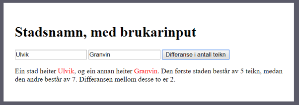
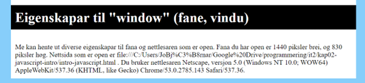

# Oppgavesamling for JavaScript

## Variablar og navngjeving
Kva er feil eller dårleg med variabelnavna under? Gje ein kort forklaring og gje dei betre variabelnavn.

- let etTall = 123
- let variabel3 = 3
- let variabel1 = "teksten skal hit"
- let detFørsteTallet = "1"
- let prosentAvTallet = 15
- let summenAvRegnestykketEr = 16

## Variabler og utregning
Les inn to tall fra brukeren. Summer disse, og skriv ut resultatet. Bruk gjerne prompt, men få til å lese fra en form også dersom du har vært borte i det før.

    
Tips

    <code>
        let tall1 = parseInt(prompt("Skriv inn tall nr. 1: ));
    </code>
     eller 
    <code>
        let tall1 = parseInt(document.getElemenById("input").value);
    </code>

## Variablar og konvertering
- Lag eit program som ber brukaren om å skrive inn eit binært tall (eksempelvis `1010`). Bruk gjerne prompt.
- Konverter dette til eit heiltall (integer).
- Skriv ut resultatet.

(Hint: `parseInt`)

Videre: Same som forrige, men no skriv brukaren inn eit hexadesimalt tall (eksempelvis «f»).

## Variablar og enkle utreknignar
La brukaren skrive inn to sjølvvalte (stads)namn og berekn deretter differansen i antall teikn. Forsøk gjerne å bruke tekstfelt og ein knapp som i skjermbiletet under. Eventuelt prompt for å gjere det enklare og tryggare. Pass i tillegg på at du unngår minusteikn i utskrifta dersom den første staden har færre antall teikn enn den andre (hint: absolutt verdi).

Bonusoppgåve: Handter brukarfeil, som til dømes manglande input.

Nokre fleire krav du kan legge til?

## Variablar og valgsetning (if)
Spør brukaren eit spørsmål. Dersom eit visst ord er inne i setningen så skriv du eit bekreftande svar, som «å, eg og likar …».

(Hint: indexOf eller includes. Bruk gjerne begge.)

## Eigenskapar om nettlesaren
Lag fylgjande oppsummering på nettsida di. NB: Dynamisk. Det vil sei at tala for til dømes bredde, høgde og nettlesarversjon skal endre seg basert på enheten du sit på. Dette kan gjerast på meir eller mindre effektive måtar. Vurder ulike alternativ. 

Legg til fleire eigenskapar du kan hente ut om du ynskjer. Liste over anbefalte ting å kjenne til:
-	Operativsystem (typisk Windows, MacOS, ChromeOS, ulike Linux-variantar el.l.)
-	Nettlesar, versjon, «produsent»
-	Størrelse på skjerm (høgde, bredde)
-	Lokasjon
-	… kva meir kan du finne ut?

## Valgsetningar: Aldersgrense
Lag ei aldersgrense på nettsida di. Spør brukaren kor gamal h*n er. Dersom over 18 kan du vise eit kattebilete pluss litt tekst, dersom ikkje skal du gje beskjed om at innhaldet dessverre er sperra (el.l.).

Hint: img src=”” er lovleg å bruke. Då vises ikkje eit bilete i heile tatt.

## Valgsetningar: Førarkort
Lag ein enkel app som kan hjelpe folk med å få vite kva setifikat dei kan ta. Du ber om alderen og presenterer deretter bileter og tekst som fortel kva dei kan ta sertifikat på (meir avansert om du vil: https://lovdata.no/forskrift/2004-01-19-298/§3-1):
A.	Yngre enn 16. Ingenting, brukaren er for ung.
B.	16 år: moped
C.	18 år: bil
D.	21 år: lastebil
E.	24 år: buss

Kan du legge inn ei øvre aldersgrense òg? Kanskje som ein beskjed om at du må gjennomføre faste kontrollar dersom du er over eit visst antall år?

## Løkker og arrays: Tilfeldige tal
Lag ein array. Bruk ei løkke for å fylle denne med 200 tilfeldige heiltal mellom 1 og 100. Sjå gjerne MDN (Mozilla Developer Network) for hjelp til Math.random. Bruk færre tal og mindre variasjon (1-10, til dømes), dersom du har behov for at du kan telle over og sjekke manuelt sjølv.

Bruk løkker og variablar for å finne ut fylgjande (ikkje innebygde funksjonar i JS):
-	Tel kor mange av tala i arrayen som er 5 eller høgare.
-	Tel kor mange som er nøyaktig 4.
-	Summer alle tala i arrayen.
-	Finn gjennomsnittsverdien av alle tala.
-	Finn det høgaste talet.
-	Finn det lågaste talet.
-	…

## Arrays og funksjonar: Biletgalleri
Lag eit enkelt biletgalleri vha. array. Meir konkret: Lagre bileta (navnet) i ein array og gjer det mogleg å bytte bilete ved å trykke på ein “neste-knapp”.
Her er det heilt sikkert fristande å finne ein ferdigløysning på nett el.l. Eg anbefalar å lage ein særs enkel versjon basert på det me har lært så langt, for å forstå prinsippet skikkeleg.

## Forms (AKA skjema) og objekt
Du skal lagre informasjon om deltakarar på eit arrangement. Du skal benytte eit form/skjema. Pass på at du benyttar gode input-typar i HTML (text, number, email osv.). Benytt required, placeholder, min, max osv.
-	Fornavn
-	Etternavn
-	Adresse
-	Postnummer
-	Poststed
-	Telefon
-	Passord
-	Fødselsår

Legg til lyttefunksjon på sjølve skjema (ikkje knappen).
Bruk evt.preventDefault for å ikkje gå til ei anna nettside når du skal behandle input frå skjema. Spør lærar!
Skriv ein oppsummering av alt som kom frå input. Eksempelvis «Jo Bjørnar Hausnes, Øvre Kråk… er 89 år gamal og …».
Lagre all informasjonen i eit objekt.

## Matbutikk: createElement og appendChild
En ny matbutikk på nett, «Rett hjem», ønsker din hjelp til å lage en bestillingsapplikasjon.

Hovedfokus: Applikasjonen skal vise fram tilgjengelige produkter med et lite bilde, et navn og en pris. Gå gjennom array med objekt og generer HTML dynamisk vha. createElement og appendChild.

Avansert: Når brukeren klikker på en matvare, skal den legges til i en «handlekurv», og en lyd kan spilles av. Hvis brukeren klikker på samme matvare flere ganger, skal antallet endres i «handlekurven». Innholdet i «handlekurven» skal hele tiden være synlig i applikasjonen, i tillegg til totalprisen for de valgte matvarene.

Igjen - her forventes det at du bruker en array med objekter (eller lignende) for å lagre matvarene. Bruk en løkke for å gå gjennom denne samlingen, der du benytter createElement og appendChild for å generere HTML-en.
Du bør og vurdere å bruke en lignende måte å lagre handlekurven på.

Tenk gjennom og begrunn hvorfor dette er en god måte å jobbe på.