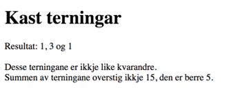
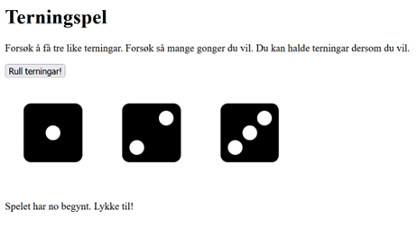
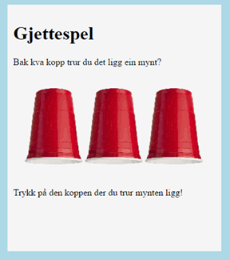
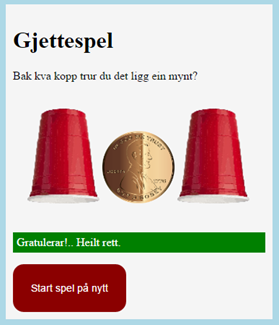
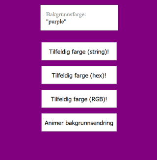
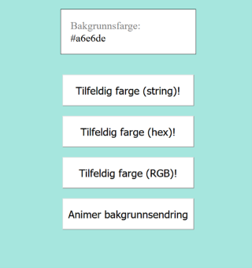
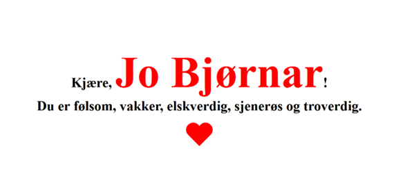

# Oppgavesamling for JavaScript

[Tilbake til samleside](README.md)

## 1. Sjekkliste for viktige ting du skal kunne
- [ ] Definere variabler, og bruke disse (`let` og `const`)
- [ ] Kunne konvertere fra en datatype til en annen, blant annet vha. `parseInt()`.
- [ ] Skrive ut til "konsollen", og kjenne til ulike måter å gjøre dette på, som `console.log()`, `console.table()`, `console.error()`, `console.warning()` m.m.
- [ ] Skrive ut til HTML, og kjenne til når du skal bruke `.innerHTML` og `.innerText`.
- [ ] Samle kode i funksjoner, og kunne kalle på disse etter behov. Du skal kunne bruke disse både med og uten parameter. Du bør også kjenne til navngitte funksjoner, anonyme funksjoner og [`arrow functions`](https://developer.mozilla.org/en-US/docs/Web/JavaScript/Reference/Functions/Arrow_functions).
- [ ] Legge til lyttefunksjoner på for eksempel en knapp, og skrive en funksjon som får noe til å skje. `knapp.addEventListener("click", funksjonsnavn)`.
- [ ] Skrive løkker som går gjennom arrays, og gjøre noe med hvert element i arrayen.
- [ ] Skrive if-setninger (valgsetninger) som gjør at programmet tar ulike valg basert på input eller andre forhold.
- [ ] Kjenne til og bruke objekter, både som enkeltobjekt og i arrays.
- [ ] Kjenne til og bruke innebygde objekter som `Math` og `Date`.
- [ ] Lese fra HTML vha. et form (skjema). Huske å bruke `.addEventListener("submit", ...)`, og ikke som `"click"` på knappen i formen.
- [ ] Opprette HTML-elementer og legge de til i DOM-en vha. JavaScript. Her skal du blant annet kunne bruke `createElement()` og `addChild()`.
- [ ] ...

Oppgavene du jobber med i denne oppgavesamlingen vil blant annet lære deg noe om punktene over. Etter at du har jobbet med oppgavene en stund, kan du gå tilbake for å se om du har oppfylt noen av disse.

## 2. Variablar og navngjeving
Kva er feil eller dårleg med variabelnavna under? Gje ein kort forklaring og gje dei betre variabelnavn.

```js
let etTall = 123
let variabel3 = [3, 3, 3]
let variabel1 = "teksten skal hit"
let detFørsteTallet = "1"
let prosentAvTallet = 15
let summenAvRegnestykketEr = 16
let 2tall = 5
let for = 10
let mitt-tall = 7
```

Her er nokre gode eksempel, forklar gjerne kvifor dei er gode:
```js
let antallElevar = 23
let elevNavn = "Ola"
let prosentFullført = 85
let sum = 42
```

## 3. Variablar og bruken av disse
Skriv eit program som skriver "5 ganger 10 er 50" til konsoll ved å bruke variablar for tala 5, 10 og 50.

## 4. Variabler, epostadresser
Skriv et program som bruker variablene under (erstatt variabelnavnene med mer passende navn) til å skrive forslag til e-post adresser til konsoll. Be gjerne om input fra brukeren.

```js
let en = fornavn
let to = etternavn
let tre = domene
```

Kriterier:
- Epostadressene skal bestå av fornavn og etternavn, separert med punktum, etterfulgt av @ og et valgfritt domene, for eksempel "test.testesen@bedrift.no"
- Epostadressene som skrives ut skal være uten mellomrom, og ikke inneholde æ, ø og å (eksempelvis blir `jo bjørnar` til `jo.bjornar`)
- Variabelen som inneholder "domene" skal ikke inneholde "@"
- Epostadressen skal lagres i en egen variabel, og denne nye variabelen skal printes ut

## 5. Variabler, 
- Hvorfor blir ikke regnestykket under regnet ut når console.log-setningen kjøres?
`console.log("4 + 6");`
- Hvorfor blir to forskjellige tall printet når koden under kjøres?
    ```js
    let a = 3.4;
    let b = 20.5;
    let total = a * b;
    console.log(total);
    console.log(parseInt(total));
    ```
- Hva er innholdet i variabelen “poeng” etter at denne koden kjøres?
    ```js
    let poeng = 0;
    poeng = poeng + 1;
    poeng++;
    poeng += 1;
    ```

## 6. Variabler, 
- Hva er feil med koden i "Kodebit 1" under? Rett den opp så den kjører.
    ```js
    let gate = 'Kongens gate'
    let husnr = 432
    let oppgang = b
    let adresse = gate + husnr + oppgang
    console.log(adresse)
    ```
- Skriv adressen ut på følgende to måter ved å bruke variabler: `Adressen er Kongens gate 432b` og `Gaten er Kongens Gate, husnummeret er 432, oppgang b`.

## 7. Variabler og utregning
Les inn to tall fra brukeren. Summer disse, og skriv ut resultatet. Bruk gjerne prompt, men få til å lese fra en form også dersom du har vært borte i det før.

<details>
    <summary>Tips</summary>
    <code>
        let tall1 = parseInt(prompt("Skriv inn tall nr. 1: ));
    </code>
    <br>eller<br>
    <code>
        let tall1 = parseInt(document.getElemenById("input").value);
    </code>
</details>

## 8. Variablar og konvertering
- Lag eit program som ber brukaren om å skrive inn eit binært tall (eksempelvis `1010`). Bruk gjerne prompt.
- Konverter dette til eit heiltall (integer).
- Skriv ut resultatet.

(Hint: `parseInt`)

Vidare: Same som forrige, men no skriv brukaren inn eit hexadesimalt tall (eksempelvis «f»).

## 9. ⭐ Variablar og enkle utreknignar
La brukaren skrive inn to sjølvvalte (stads)namn og berekn deretter differansen i antall teikn. Forsøk gjerne å bruke tekstfelt og ein knapp som i skjermbiletet under. Eventuelt prompt for å gjere det enklare og tryggare. Pass i tillegg på at du unngår minusteikn i utskrifta dersom den første staden har færre antall teikn enn den andre (hint: absolutt verdi).


Bonusoppgåve: Handter brukarfeil, som til dømes manglande input.

Nokre fleire krav du kan legge til?

[Løysingsforslag](./løsningsforslag/stadsnamn/)

## 10. Variablar og valgsetning (if)
Spør brukaren eit spørsmål. Dersom eit visst ord er inne i setningen så skriv du eit bekreftande svar, som «å, eg og likar …».

(Hint: `indexOf()` eller `includes()`. Bruk gjerne begge.)

[Løysingsforslag](https://github.com/hausnes/oppgavesamling/tree/main/l%C3%B8sningsforslag/includes)

## 11. Eigenskapar om nettlesaren
Lag fylgjande oppsummering på nettsida di. NB: Dynamisk. Det vil sei at tala for til dømes bredde, høgde og nettlesarversjon skal endre seg basert på enheten du sit på. Dette kan gjerast på meir eller mindre effektive måtar. Vurder ulike alternativ. 


Legg til fleire eigenskapar du kan hente ut om du ynskjer. Liste over anbefalte ting å kjenne til:
-	Operativsystem (typisk Windows, MacOS, ChromeOS, ulike Linux-variantar el.l.)
-	Nettlesar, versjon, «produsent»
-	Størrelse på skjerm (høgde, bredde)
-	Lokasjon
-	… kva meir kan du finne ut?

## 12. Valgsetningar: Aldersgrense
Lag ei aldersgrense på nettsida di. Spør brukaren kor gamal h*n er. Dersom over 18 kan du vise eit kattebilete pluss litt tekst, dersom ikkje skal du gje beskjed om at innhaldet dessverre er sperra (el.l.).

Hint: 
- `img src=""` er lovleg å bruke. Då vises ikkje eit bilete i heile tatt
- Det er fleire måtar å gjere noko "usynleg" på, til dømes `visibility` og `display` (frå CSS)
- Du kan lukke ei fane (den aktive) frå JS i nokre nettlesarar, men dette vil ikkje alltid fungere
- Du kan alltid "redirecte" til ei anna nettside

## 13. ⭐ Valgsetningar: Førarkort
Lag ein enkel app som kan hjelpe folk med å få vite kva setifikat dei kan ta. Du ber om alderen og presenterer deretter bileter og tekst som fortel kva dei kan ta sertifikat på (meir avansert om du vil: [Lovdata](https://lovdata.no/forskrift/2004-01-19-298/§3-1)):
- Yngre enn 16. Ingenting, brukaren er for ung.
- 16 år: moped
- 18 år: bil
- 21 år: lastebil
- 24 år: buss

Kan du legge inn ei øvre aldersgrense òg? Kanskje som ein beskjed om at du må gjennomføre faste kontrollar dersom du er over eit visst antall år?

Det er anbefalt å teikne eit flytskjema for denne oppgåva.

[Løysingsforslag](./eksempel/ifelse/)

## 14. ⭐ Gjettespel
Før du begynner på oppgåva: Finn ut korleis du kan generere tilfeldige tal. Hint `Math.random()` hjå `MDN`. Her finn du meir generelle og brukandes hjelp enn det som står i boka.

Versjon 1: Grunnleggande
- Lagre eit tal mellom 0-10 i ein variabel. La dette vere tilfeldig.
- Be brukaren om å gjette på eit tal mellom 0-10 og lagre dette i ein ny variabel.
- Kontroller om brukaren har gjetta riktig, og gje ein passande tilbakemelding.

Versjon 2: Avansert
- La brukaren få gjette flere gonger dersom h*n tok feil, og gje hint som «for høgt» eller «for lågt». La brukaren gjette fram til det blir riktig.
- Tell kor mange gonger brukaren har gjetta, eller sett ein begrensing på dette.
- Legg til fleire krav om du vil.

## 15. Halloween, skrøymande god app (timing)
Lag ei nettside som har som mål å skrøyme brukaren. Eksempelvis kan du laste inn ei nettside med behagelege fargar, musikk og generelt god stemning. Etter ei tilfeldig tid så kjem det ein høg lyd og eit skrøymande bilete (eller ein video) – samt andre endringar du ser kan vere spanande.

Hint: Timing-funksjonar i JS. `setTimeout` og/eller `setInterval`.

## 16. ⭐ Løkker og arrays: Tilfeldige tal
Lag ein array. Bruk ei løkke for å fylle denne med 200 tilfeldige heiltal mellom 1 og 100. Sjå gjerne MDN (Mozilla Developer Network) for hjelp til Math.random. Bruk færre tal og mindre variasjon (1-10, til dømes), dersom du har behov for at du kan telle over og sjekke manuelt sjølv.

Bruk løkker og variablar for å finne ut fylgjande (ikkje innebygde funksjonar i JS):
-	Tel kor mange av tala i arrayen som er 5 eller høgare.
-	Tel kor mange som er nøyaktig 4.
-	Summer alle tala i arrayen.
-	Finn gjennomsnittsverdien av alle tala.
-	Finn det høgaste talet.
-	Finn det lågaste talet.
-	…

## 17. ⭐ Arrays og funksjonar: Biletgalleri
Lag eit enkelt biletgalleri vha. array. Meir konkret: Lagre bileta (navnet) i ein array og gjer det mogleg å bytte bilete ved å trykke på ein “neste-knapp”.
Her er det heilt sikkert fristande å finne ein ferdigløysning på nett el.l. Eg anbefalar å lage ein særs enkel versjon basert på det me har lært så langt, for å forstå prinsippa skikkeleg.

## 18. Terningspel
Ta utgangspunkt i 2 terningar, eller fleire. Når sida lastast på nytt, eller når ein trykker på ein knapp, skal terningane få kvar sin verdi mellom 1-6. Skriv ut kva desse er. Deretter kan du til dømes sjekke om alle er like, om dei totalt overstig ein viss sum osv. Gje deg sjølv nokre utfordringar her (også med å vise fram bileter, om du vil). 

### V1: Enkel versjon:



### V2: Meir avansert versjon:

 

### v3: Vidare arbeid 
Bruker løkker og arrays for å generere så mange terningkast som brukaren ynskjer.

## 19. Hjelp kyllingen

Du skal lage deler av ein app for ungar. Nødvendige bileter skal du laste ned sjølv. Appen (nettsida) opnar med at eit bilete av eit egg vises fram, med forklarande tekst til brukaren. 
 
Oppstart. (Manglar informasjon til brukaren, mellom anna.)


Steg/klikk nr. 4: Kylling inne i egg. Manglar elles nokre detaljar frå oppgåvetekst.


Funksjonalitet vidare, når brukaren trykker på egget:
- Klikk nr. 1: Egget får ei lita sprekke tvers over.
- Klikk nr. 2: Større sprekke.
- Klikk nr. 3: Egget opnar seg endå meir, og du ser deler av ein kylling innanfor egget.
- Klikk nr. 4: Den øvste delen av egget ligg på bakken/golvet, der resten av egget står med kyllingen oppi.
- Klikk nr. 5: Brukaren får beskjed om at ein ikkje kan trykke på egget meir, og at ein er ferdig.

Presenter innhaldet på en oversiktelig og god måte. Bileta skal vere tilpassa på ein fornuftig måte, med tanke på til dømes format, størrelse og oppløysning.

## 20. Gjettespel, extended edition




Grunnfunksjonalitet
NB: Dette programmet vil etterkvart få meir avanserte krav til funksjonalitet.

Kravspesifikasjon, programmering og design:
- Når spelet startar opp skal ein mynt plasserast bak ein av dei tre posisjonane (grafisk: koppane). 
- Deretter er det opp til brukaren å trykke på ein av dei tre koppane, for å gjette kvar han eller ho trur mynten er. 
- Programmet ditt skal gje ein tilbakemelding som fylgjer:
    - “Gratulerer!” om riktig, og “Dessverre, det var feil!.” om det var feil.
    - Dersom ein gjetta feil, men var nært (nabokoppen) skal dette bli lagt til i tilbakemeldinga: “.. men du var nærme!”
    - Dersom ein gjetta feil, men var langt vekke (to koppar vekke) skal dette bli lagt til i tilbakemeldinga: “.. og du var langt unna!”
- Tilleggskrav, visuelt:
    - Bruk animasjon for å avsløre kva val som er tatt, og resultatet (til dømes kan du la koppen gradvis flytte seg oppover).
    - Koppen kan bytast ut med mynten dersom ein har gjetta riktig, eventuelt visast delvis under.
    - Det skal vere raud bakgrunnsfarge på tilbakemeldinga (i form av tekst) dersom ein har gjetta feil, og grønt om ein gjettar riktig. Skriftfargen vel du sjølv. Det skal vere lett å lese.
    - Etter at ein har gjetta må ein trykke på ein knapp for å starte på nytt. Denne knappen skal ikkje vere synleg før ein har gjennomført ein “gjetting”.
    - Det skal ikkje vere mogleg å gjette fleire gonger enn ein, der brukaren skal få tilbakemelding og bli “blokkert” dersom ein forsøker fleire gonger.

## 21. “Chatbot”
Me forsøker å få det til å sjå ut som om brukaren av programmet har ein samtale med datamaskina. 

Tips:
- Loggfør all kommunikasjonen i ei punktliste (ul-tag med li-taggar inni). Oppdater denne etterkvart som programmet skrider fram.
- Spør etter navn og sei “Hei, navn!”
- Spør etter interesse/hobby, og følg dette opp i kommunikasjonen. Type “Å, jeg også liker …”. Korleis skal du handtere ulike moglege utfall? Korleis kan du styre kommunikasjonen for å gjere det enklare for deg?
- Viktig: Bruk `toUpperCase()` og `toLowerCase()` for å handtere problematikk med store og små bokstavar, bruk `||` (or) og `&&` (and) for å kombinere ulike testar, og `includes()` for å leite etter spesifikke ord inne i ein setning (til dømes dersom brukaren svarar med lengre setningar). 

Avansert: Forsøk å unngå problem med dette at brukaren gjerne kan skrive “jeg liker i hvert fall ikke ski”, og at det blir tolka som at ski er ei interesse.

## 22. Tilfeldige fargar
Lag funksjonar som returnerer ein tilfeldig fargeverdi. Dette kan du til dømes bestemme at skal vere type:
- red, blue, green, pink osv. (altså `string`)
- RGB-referansar
- hexadesimale kodar

Slå opp på `W3Schools` korleis du refererer til fargar i dei ulike “systema”. Kva er lettast å generere tilfeldig synes du?

Bruk den tilfeldige fargen for gjere ein endring på bakgrunnsfargen til body (avansert: ved faste intervall). Skriv til ei kvar tid ut kva som er satt som bakgrunnsfarge. Sjå eksempel her:




Lag gjerne animasjon av overgangen mellom ein del ulike fargar òg, om du har lyst å gå vidare i pensum.

## 23. OLED-assistent
OLED-skjermar slit med at dei ikkje kan ha eit statisk bilete over lengre tid, då dei kan oppleve «innbrenning» (meir eller mindre permanente pikslar). Du kan til dømes sjå TV2-logoen innbrent oppe i høgre hjørne dersom du ser mykje på den kanalen.

Lag ein app som testar for denne innbrenninga. Funksjonalitet:
- Ved faste intervall skal heile bakgrunnsfargen endre seg. 
- Generer tilfeldige fargar og skift mellom desse. 
- Få til ein gradvis overgang frå ein farge til ein annan.

Avansert: Lag til eit valg for innstillingar, der brukaren kan bestemme kor ofte fargane skal endre seg.

Finn gjerne på eigne vriar på denne oppgåva.

## 24. ⭐ Forms (AKA skjema) og objekt
Du skal lagre informasjon om deltakarar på eit arrangement. Du skal benytte eit form/skjema. Pass på at du benyttar gode input-typar i HTML (text, number, email osv.). Benytt required, placeholder, min, max osv.
-	Fornavn
-	Etternavn
-	Adresse
-	Postnummer
-	Poststed
-	Telefon
-	Passord
-	Fødselsår

Konkretisering og tips:
- Legg til lyttefunksjon på sjølve skjema (ikkje knappen).
- Bruk evt.preventDefault for å ikkje gå til ei anna nettside når du skal behandle input frå skjema. Spør lærar!
- Skriv ein oppsummering av alt som kom frå input. Eksempelvis «Jo Bjørnar Hausnes, Øvre Kråk… er 89 år gamal og …».
- Lagre all informasjonen i eit objekt.

## 25. ⭐ Matbutikk: createElement og appendChild
En ny matbutikk på nett, «Rett hjem», ønsker din hjelp til å lage en bestillingsapplikasjon.

Hovedfokus: Applikasjonen skal vise fram tilgjengelige produkter med et lite bilde, et navn og en pris. Gå gjennom array med objekt og generer HTML dynamisk vha. createElement og appendChild.

Avansert: Når brukeren klikker på en matvare, skal den legges til i en «handlekurv», og en lyd kan spilles av. Hvis brukeren klikker på samme matvare flere ganger, skal antallet endres i «handlekurven». Innholdet i «handlekurven» skal hele tiden være synlig i applikasjonen, i tillegg til totalprisen for de valgte matvarene.

Igjen - her forventes det at du bruker en array med objekter (eller lignende) for å lagre matvarene. Bruk en løkke for å gå gjennom denne samlingen, der du benytter createElement og appendChild for å generere HTML-en.
Du bør og vurdere å bruke en lignende måte å lagre handlekurven på.

Tenk gjennom og begrunn hvorfor dette er en god måte å jobbe på.

[Ressurser til denne oppgaven, samt løsningsforslag](./løsningsforslag/matbutikk/)


## 26. ⭐ async function og await
Be om data (typisk 1 stk brukar til å byrje med) frå [randomuser.me](https://randomuser.me/documentation). Hugs at dette kan ta litt tid, så her må du bruke async function og await. Data kjem i JSON-format. Konverter etter behov.

- Steg 1: Skriv ut ein del av informasjonen i `console`, til dømes namn, land og eit bilete. Kontroller at alt fungerer så langt.
- Steg 2: Benytt `createElement` og `appendChild`, slik du gjorde i oppgåva om matbutikken, for å teikne opp dei tilfeldige brukarane på nettsida.


## 27. Kryptering
NB: Denne oppgåva kan løysast på fleire ulike måtar, og på meir eller mindre avanserte måtar. Begynn med ein tilnærming som gjer meining for din del. Ikkje forsøk å løys alt på ein gong, få ein og ein enkelt del til å fungere for seg først.

Lag ei nettside som lar deg enkelt leike med å kunne både kryptere og dekryptere meldingar (i tekstform). Me bruker Caesar-kryptering for å oppnå dette, der du kort fortalt ved å kryptere gjer ein forskyvning i alfabetet, der til dømes ein `a` blir `b` dersom du har ein forskyvning (nøkkel) satt til 1. Du kan sjølvsagt legge til andre krypteringsmåtar (algoritmar) dersom du vil.

Legg inn ei moglegheit for å “brute force” ein kryptert melding, dvs. at du forsøker alle moglege kombinasjonar.

Bruk tid på å planlegge løysinga! Gjerne saman med nokon andre. Går det an å skrive deler av programmet kvar for seg og slå saman?

(Fleire detaljar om krypteringa blir gjennomgått i timane, samt “oppstartshjelp”.)

## 28. Array-repetisjon, “skryteApp”
Det er dårleg stemining i klasserommet. Elevar snakkar stygt til kvarandre. Løysinga blir derfor å lage eit program som gjer som resultat noko som dette:



Forslag til fokus:
- Spør kven ein skal skryte av.
- Spør kor mange skryteord du ynskjer å ta med.
- Skriv ein funksjon som tek inn punkta over og skriv ut resultatet til HTML.
    - Her må/bør du bruke løkke i forbindelse med array.
- Skriv CSS som gjer dette endå meir “koseleg”. Mitt hjarte er animert (det pulserer), klarar du det?
- Ekstra: Sjekk at det ikkje blir bedt om fleire skryteord enn det ligg i arrayen. Sjå òg til at det er minst 1 stk. skryteord.

Samling med eventuelle skryteord (eksempel):
```js
let skryteOrd = [
    "sjenerøs",
    "omgjengelig",
    "ambisiøs",
    "munter",
    "hardtarbeidende",
    "troverdig",
    "tålmodig",
    "optimistisk",
    "følsom",
    "sosial",
    "besluttsom",
    "morsom",
    "blid",
    "vakker",
    "lekende",
    "elskverdig",
    "talentfull",
    "begavet"
];
```

### Alternativ oppgåvetekst: 
Lag ein “troll”-generator. Altså, spy ut spam i ulike diskusjonsforum/kommentarfelt med tilfeldige, provoserande utsagn. NB: Ikkje strekk det for langt, slik at du faktisk gjer dette i praksis.

## 29. Array-repetisjon, “sensureringsApp”
Ta inn ein setning og sensurer bort ord som ligg i ei liste (array) med problematiske ord. Byt ut med noko anna.

Hint: Hugs tidlegare oppgåve på prøve der du luka ut upassande ord.

## 30. Array med objekt: Brukerliste ("Date")
Opprett ein array med minst 3 ulike objekt, der kvar av desse skal innehalde fylgjande informasjon:
- Navn
- Fødselsår

Lag ein funksjon eller løkke som går gjennom alle elementa og bestemmer alder til kvar person. Skriv berre ut personar under 20 (eller andre liknande krav).

Hint: Bruk «Date»-objektet. `let tid = new Date();` Slå opp kva du kan hente ut ved å skrive tid.xxx

## 31. Filmer i array med objekt
1.	Lag en nettside for å registrere filmer med følgende informasjon:
    - Tittel
    - Regissør
    - Om du har sett filmen
2.	Informasjonen fra nettsiden skal lagres i en array med objekter. Hvert objekt skal beskrive en film med egenskaper for tittel, regissør og om du har sett filmen eller ikke (true/false).
3.	Legg inn 5 filmer som du har sett og 5 filmer som du ikke har sett.
4.	Skriv ut alle filmene. Bruk en løkke for å gå gjennom arrayen og skrive filmenes tittel og regissør til nettsiden.
5.	Sorter objektene i arrayen etter filmtittel. Skriv ut den sorterte arrayen til nettsiden for å sjekke at de er sortert riktig.

## ⭐ 32. Påskerenn
Du skal lage eit program som skal brukast under det årlege påskerennet på stølsområdet Olastøl i Hardanger. Her samlast gode hyttenaboar for å gjennomføre konkurransar i 3 stk. ulike aktivitetar. 

Prestisje, knekte lårhalsar og forholdsvis godt humør er viktige stikkord.

Lag ein liten introduksjon til påskerennet øverst i dokumentet, gjerne med noko enkel påskegrafikk. Du blir ikkje vurdert på kor bra denne delen ser ut.

### Krav 1: 
Deltakerlista varierer frå år til år, men du skal forhåndsregistrere 5 stk. deltakarar (hardkoda inn ved oppstart). Typisk bruker du arrays med objekt (eventuelt Map). Informasjonen som MÅ vere med om desse er:
- Navn
- Alder
- Resultat frå aktivitet 1 (endå ikkje nokre data her)
- Resultat frå aktivitet 2 (endå ikkje nokre data her)
- Resultat frå aktivitet 3 (endå ikkje nokre data her)
- Total poengsum, resultatet frå dei tre aktivitetane

Utover dette kan du legge til meir informasjon etter behov. Kva sjølve aktivitetane består av treng du ikkje ta stilling til, om du ikkje vil.

### Krav 2: 
Deltakerlista skal skrivast ut til brukaren, ved oppstart, slik at ein ser kven som er med. Typisk ser ein for seg at navn og alder må vere med i denne oversikten. Altså, deler av data frå “krav 1” skal visast ved oppstart.

### Krav 3: 
Det skal vere mogleg å registrere nye deltakarar, utover dei forhåndsbestemte. Igjen er navn og alder det som er nødvendig på dette punktet. Etter at ein ny deltaker er registrert skal deltakerlista (frå krav 2) oppdaterast.

### Krav 4: 
Det skal vere mogleg å registrere resultat frå konkurransane. Eksempelvis, deltakar nr. 1, “Jo Bjørnar”, har fått 34 poeng under aktivitet nr. 1, 22 p. for akt. 2 og 31 p. for akt. 3. Basert på dette skal data i kolleksjonen oppdaterast, og total poengsum reknast ut. 

Du set sjølv begrensingar på maks poengsum (til dømes maksimum 100 poeng per aktivitet) og andre eventuelle reglar/krav.

### Krav 5: 
Det skal vere mogleg å vise ein oppsummering av resultata frå konkurransen. Typisk vil ein ved å trykke på ein knapp få ei utskrift som viser resultatlista sortert på den totale poengsummen. Viktig: Det skal berre skrivast ut resultat for deltakarane som har fått ein total poengsum. 

Når det gjeld dei tre første plassane skal det visast fram pokalar (eller annan unik grafikk, type bilete/ikon eller liknande) foran desse. Resten av plasseringane bør det stå nummer foran.

## 33. Munnleg-praktisk eksempel, hopprenn
Du skal lage eit program som reknar ut poengsummar under eit hopprenn. For å gjere det litt enklare ser me for oss at alle operasjonar blir gjort på same skjerm, det vil sei at både inntasting av alle nødvendige verdiar og resultatet kjem same plass.

Hoppreglane er som følger:
- Eit kvart hopp har ein lengde i antall meter, og stilkarakterar frå 5 ulike dommerar.
- Lengdepoenga reknast ut slik at for kvar meter over K-punkt skal ein få poeng i form av meterverdien, pluss ein grunnpoengsum lik 60.
- Formelen blir då lengdePoeng = 60 + meterverdi * (lengde – K-punkt).

Eksempelvis vil du dersom du hoppar 123 meter i ein bakke med K-punkt på 120 meter og meterverdi på 1.8 få 65.4 poeng.
- Stilpoeng reknast ut slik at 5 ulike dommerar gjer sine karakterar mellom 0 og 20, med intervall på 0.5. Det vil sei at ein til dømes kan gje 14.5 og 18, men ikkje 14.23 osv. Når alle har gjort dette skal høgaste og lågaste karakter strykast. Det er altså berre dei 3 karakterane ”i midten” som er med i endeleg poengsum.
- Total poengsum reknast ut ved at du tek lengdepoenga og legg saman med stilpoenga.

## ⭐ 34. API-kall, createElement og appendChild, analyse

### Del 1:
Bruk [randomuser.me](https://randomuser.me/) for å hente ein tilfeldig “person”, og opprett deretter ei overskrift med navnet til personen du henta, ei lenke/paragraf med e-posten og eit bilete. Bruk createElement og appendChild for å lage HTML-en.

### Del 2:
Denne gongen ber du brukaren av programmet om å oppgje kva hen er på utkikk etter, til dømes kan du spørre om:
-	Kjønn
-	Nasjonalitet
-	Antall

Deretter utfører du det same API-kallet og opprettar HTML-en basert på dette. 

Bruk òg tid på å plassere innhaldet i div-boksar og stilsett dette slik at det ser bra ut vha. CSS.

### Del 3:
No skal du lage ein faktisk "tjeneste" ut av konseptet over. Til dømes kan du lage ein eigen "Tinder"-versjon. 

Forslag: 
- presenter ein og ein person for brukaren 
- la brukaren velgje å "like" eller "swipe vekk" denne
    - Dersom ein person får ein "like" havnar denne i ei liste (til dømes array med objekt)
    - I det andre tilfellet kan du leggje personen til i ei anna liste
- Analyser data (listene frå punktet over):
    - Forsøk å gjennomfør ein tolkning av data du sit att med
    - Kva type personar blir "typisk likt"? Ser du noko mønster?