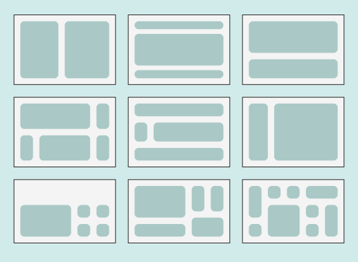

# Oppgåver innan HTML og CSS
[Tilbake til samleside](../README.md)

Har det ein verdi å kunne løyse oppgåvene under utan å måtte slå opp alt heile tida?
 
Snakk saman, eller snakk med deg sjølv, når du løyser oppgåvene. Eg kjem til å repetere og diskutere oppgåvene i fellesskap ved første/neste høve.

## 1. Samleoppgåve, grunnleggande HTML, CSS og JS:

`Prosjektmappe` og `HTML`-dokument:
- Opprett ei mappe som oppgåva skal lagrast i. 
- Opne denne MAPPA i Visual Studio Code.
- Opprett eit HTML-dokument. Kva navn?
- Legg inn minimum fylgjande taggar: 
    - Standardtaggane: html, head, body, title mm. 
    - h1-h3 
    - p 
    - img
    - videofil eller YouTube (integrert video)
    - liste, både nummerert og unummerert 
    - table 
    - …
- Legg til main, nav, header, figure, footer, aside, … (semantiske taggar, HTML5)
- Legg til meir om tid og lyst!

Opprett eit `CSS`-dokument.
- Koble stilarket til HTML.
- Stilset som eit minimum ved å endre bakgrunnsfarge, skriftfarge, margin, padding, skrifttype og størrelse på enkelte, utvalte taggar (eksempelvis h1, h2 og p).
- Lag og bruk ein navngitt `klasse` som kan gjenbrukast til å gjere fylgjande:
    - Definerer klassenavnet ***boks*** 
    - Set bredde og høgde til 500 px.
    - Kantlinje på 1 px bredde.
    - Avstand frå kantlinje til innhold/tekst er 1 em.
    - …
- Lag og bruk ein navngitt `ID` som skal bli brukt til å sette eit banner/ein header per side:
    - Definer ein ID med navn ***banner***.
    - Set bredde til 100%.
    - Midtstiller teksten.
    - Set skriftstørrelsen til 3rem.
    - Margin til 1rem.
    - …

- Forsøk i tillegg å legge til: 
    - Bruk [Google Fonts](https://fonts.google.com/), eller finn andre spanande alternativ (kva finst av moglegheiter?)
    - Ein midlertidig endring av til dømes bakgrunnsfarge dersom du tek muspeikaren over eit element (del av nettsida), eksempelvis ei overskrift (h1).
    - Ein animasjon/gradvis overgang til endringen over, og tilbake til originaltilstand.
    - Legg til meir om tid og lyst!

Opprett eit `Javascript`-dokument.
- Koble Javascript-dokumentet til HTML. Sjå til at JS-koden ikkje køyrer før HTML og CSS er lasta inn.
- Legg til eit varsel som dukkar opp over nettstaden, der det står "Velkommen!".
- Spør brukaren om navnet, og bruk deretter dette til å endre innhaldet på sjølve nettsida. Eksempelvis kan det stå "Velkommen, Jo Bjørnar" om eg besøkte sida.
- Skriv ut kva nettlesar eller operativsystem brukaren benyttar.
- Legg til ein knapp som endrar bakgrunnsfargen på heile nettsida til å vere gul, og tilbake igjen til det den originalt var om du trykker ein gong til.
- Opprett ein HTML-tag i JS, endre innhaldet og legg den til i DOM-en.
- Legg til meir om tid og lyst!

## 2. Bilder, base64
Utforsk: Hvordan bruke base64 for å lagre/bruke bilder i for eksempel en webapplikasjon. 

Du kan bruke https://elmah.io/tools/base64-image-encoder/ Les om tjenesten her inne, og forsøk gjerne å bruke dette på en enkel nettside.

## 3. Bilder, SVG
Utforsk: Hvordan bruke SVG-filer på nettsidene dine? Hva er fordelene? Hvor mye plass tar disse "filene" (må det være en fil)?

Bruk https://www.w3schools.com/graphics/svg_intro.asp som startpunkt.

## 4. Bilder, favicon
Utforsk: Hvordan bruke favicon for å gi et (godt) ikon for å skille ut din nettside i fanen i nettleseren? Hvordan kan du lage et slikt ikon?

Bruk https://www.w3schools.com/html/html_favicon.asp som startpunkt.

## 5. Lage ulike design vha CSS grid
Bruk CSS grid for å gjenskape disse oppsettene (bildet er hentet fra Aschehoug sin IT1-lærebok).

## 6. Tegne et sjakkbrett vha CSS
Skriv kode som tegner opp et sjakkbrett på skjermen. 8x8. Annenhver rute svart og hvit. NB: Denne oppgaven kommer typisk etter at du har forstått det grunnleggende ved Flexbox og CSS grid.

[Løsningsforslag](../eksempel/css/sjakkbrett-flex-vs-grid/) ved å bruke både Flexbox og CSS grid.